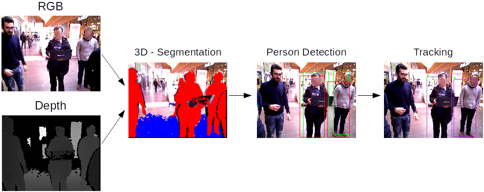
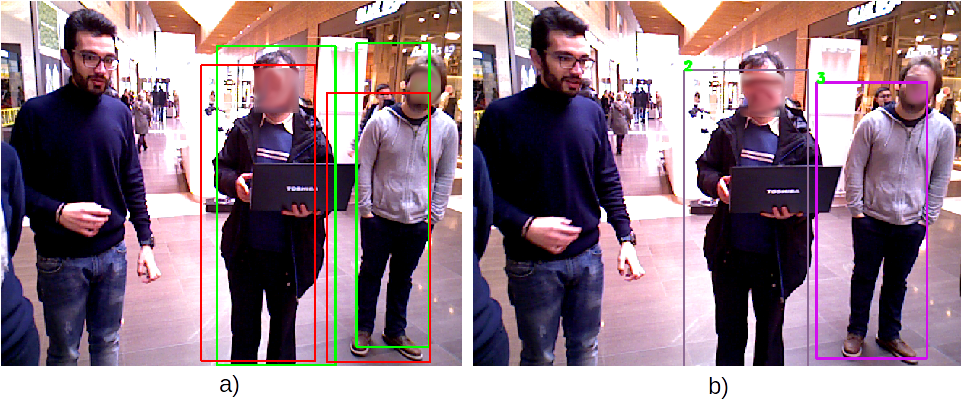

# R-GBD Persond Tracking
R-GBD Person Tracking (RGPT) is a ROS framework for detecting and tracking people from a mobile robot.

## Requirements

AT requires the following packeges to build:

* OpenCV 
* Boost
* PCL
* ROS Indigo
* OpenMP

## How to build
RGPT works under Linux 14.04 and ROS Indigo. For building the source, you
have to put the repository inside your catking workspace and then
follows the following command sequence:

* rospack profile
* catkin_make

## How to setup

_INPUT:_
	Check the file people_detection_complete.launch inside the folder
	people_detection/launch
	
	Example:
	<launch>
		<arg name="prefix" value="/top_camera" />
		<node name="ground_detector" pkg="ground_detector" type="ground_detector_node" output="screen">
			<param name="theta" value="12"/> <!-- xtion tilt angle -->
			<param name="ty" value="1.5"/> <!-- xtion y traslation -->
			<param name="debug" value="false"/> <!-- show the segmentation output -->
			<param name="groundThreshold" value="0.05" /> <!-- under this threshold is considered ground --> 
			<param name="voxel_size" value="0.06" /> <!-- voxel size -->
			<param name="min_height" value="1.0" /> <!-- min blob height -->
			<param name="max_height" value="2.0" /> <!-- max blob height -->
			<param name="min_head_distance" value="0.3" /> <!-- min distance between two heads -->
			<param name="sampling_factor" value="3" /> <!-- sampling cloud factor -->
			<param name="apply_denoising" value="false" /> 
			<param name="mean_k_denoising" value="5" /> <!-- meanK for denoising (the higher it is, the stronger is the filtering) -->
			<param name="std_dev_denoising" value="0.3" /> <!-- standard deviation for denoising (the lower it is, the stronger is the filtering) -->
			<param name="max_distance" value="6" /> <!-- detection rate in meters -->
			<param name="depth_topic" value="$(arg prefix)/depth/image_raw" />
			<param name="camera_info_topic" value="$(arg prefix)/depth/camera_info" />
			<param name="rgb_topic" value="$(arg prefix)/rgb/image_raw" />			
		</node>
		
		<node name="dispatcher_node" pkg="dispatcher_node" type="dispatcher_node" output="screen">
			<param name="min" value="1.5"/> <!-- min value for tracking only the face -->
		</node>
		
		<node name="people_detector" pkg="people_detection" type="people_detection_node" output="screen">
			<param name="dataset" value="$(find people_detection)/config/inria_detector.xml"/> <!-- dataset filename -->
			<param name="confidence" value="65."/> <!--min confidence for considering the blob as a person -->
			<param name="image_scaling_factor" value="1.5"/><!--scaling factor for image detection (if you increase it, the detection speed increses and the precision decreses) -->
		</node>
		
		<node name="visual_tracker" pkg="visual_tracker" type="visual_tracker" output="screen">
			<param name="image_scaling_factor" value="1.5"/><!--scaling factor for image detection (if you increase it, the detection speed increses and the precision decreses) -->
		</node>
		
	</launch>
	
_OUTPUT:_
	topic: /tracks
	Message type: Traks
		A vector containing:
			int32 id
			Point2i point2D
			Point3D point3D	
			
			
			
## How to use
Once the build phase has been successfully, you can use RGPT by launching the following command:

* roslaunch people_detection people_detection_complete.launch

## How it works:

RGPT is divided in three steps:

* RGBD Segmentation
* People Detection
* People Tracking

A general scheme of the modules of the 3D person detection and tracking framework is showed in the following 
figure:

The framework is made of three main steps: (i) scene segmentation, (ii) person detection, and (iii) person
tracking. Thanks to the RGB-D camera (i.e. Asus Xtion) mounted on the top of the robot, we are
able to segment the scene and exclude the part of the image that is not useful for the task of person
detection. By knowing the position of the camera and the tilt angle, we compute a roto-translation
matrix R in order to rotate and translate the depth provided by the camera in order to straighten the
scene. All the common state-of-the-art techniques for finding the ground and the walls in the
shopping mall environment cannot be used due to the glasses of the shops as well as the movements
of the mobile platform. So, by straightening the scene we can assume to exclude from the depth all
the points under a threshold of 5cm and to consider them as belonging to the ground.
The same assumption is considered for all the points above 2m of height (basically, we assume
that a person is tall less then 2 meters). All the glass walls are excluded by analyzing the edges of
the shape made of the points considered as ground. In fact, we project all such points in a top view
frame in order to detect the left and right edges of the ground and to exclude all the points outside the
left and right boundaries.

Then, the remaining points are grouped by using
a clustering method based on the Euclidean distance. From each cluster, we extract the top left and
the bottom right points and by using the inverse of the roto-translation matrix R^−1 , we convert those
points in 2D image points obtaining then a bounding box around the candidate to be a person.
To recognize if a candidate is a person, we use an approach based on the Aggregate Feature Channels
(ACF). The ACF method computes the same features as in the Integral Channel Features (ICF), where given an image,the features are
computed as single channels. In particular, the number of
channels is equal to 10: 3 for the color components L, U, and V ( assuming the LUV color space),
6 for computing the HOG features (each channel represents a different gradient orientation) and, 1
channel for the gradient magnitude. This kind of features is integrated in a detector called The Fastest
Pedestrian Detector in the West (FPDW). The FPDW analyses the features at different scales by
approximating them at nearby scales. Such a strategy increases the detector speed maintaining robust
detection performance.

Finally, a multiple person tracker is used for tracking the detections. The main idea behind the
tracker is to use the appearance model of the detections together with a nearest neighbor approach
for data association. The appearance is given by using the RGB color information with the Speed Up
Robust Features (SURF). The extracted information is reduced by using a sparse dictionary. Then,
an on-line Adaboost classifier is assigned to each dictionary. The classifier is trained with one positive
sample, and all the other detections together with 10 random patches chosen over the entire image
without considering the patch of the image containing the detection, are used as negative samples.
Then, a Kalman filter is used for filtering the noise of each track. A track is assigned to the current
detection if, from the set of classifiers and Kalman filters, the confidence of one classifier is greater than
a certain threshold _c_, or if the euclidean distance between the past track position and the current
position is less then a threshold _e_.
